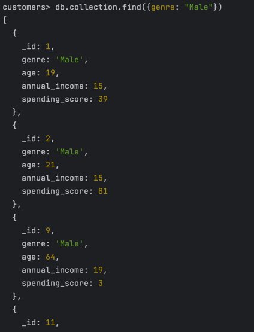

## Датасет

[Mall Customers](https://www.kaggle.com/datasets/shwetabh123/mall-customers)

## Установка и запуска

```bash
docker compose up -d
docker compose exec -it mongodb /bin/sh
mongosh
```
мы в системе

## Загрузка датасета

```bash
db.collection.insertMany([{'_id': 1, 'genre': 'Male', 'age': 19, 'annual_income': 15, 'spending_score': 39}, {'_id': 2, 'genre': 'Male', 'age': 21, 'annual_income': 15, 'spending_score': 81}, {'_id': 3, 'genre': 'Female', 'age': 20, 'annual_income': 16, 'spending_score': 6}, {'_id': 4, 'genre': 'Female', 'age': 23, 'annual_income': 16, 'spending_score': 77}, {'_id': 5, 'genre': 'Female', 'age': 31, 'annual_income': 17, 'spending_score': 40}, {'_id': 6, 'genre': 'Female', 'age': 22, 'annual_income': 17, 'spending_score': 76}, {'_id': 7, 'genre': 'Female', 'age': 35, 'annual_income': 18, 'spending_score': 6}, {'_id': 8, 'genre': 'Female', 'age': 23, 'annual_income': 18, 'spending_score': 94}, {'_id': 9, 'genre': 'Male', 'age': 64, 'annual_income': 19, 'spending_score': 3}, {'_id': 10, 'genre': 'Female', 'age': 30, 'annual_income': 19, 'spending_score': 72}, {'_id': 11, 'genre': 'Male', 'age': 67, 'annual_income': 19, 'spending_score': 14}, {'_id': 12, 'genre': 'Female', 'age': 35, 'annual_income': 19, 'spending_score': 99}, {'_id': 13, 'genre': 'Female', 'age': 58, 'annual_income': 20, 'spending_score': 15}, {'_id': 14, 'genre': 'Female', 'age': 24, 'annual_income': 20, 'spending_score': 77}, {'_id': 15, 'genre': 'Male', 'age': 37, 'annual_income': 20, 'spending_score': 13}, {'_id': 16, 'genre': 'Male', 'age': 22, 'annual_income': 20, 'spending_score': 79}, {'_id': 17, 'genre': 'Female', 'age': 35, 'annual_income': 21, 'spending_score': 35}, {'_id': 18, 'genre': 'Male', 'age': 20, 'annual_income': 21, 'spending_score': 66}, {'_id': 19, 'genre': 'Male', 'age': 52, 'annual_income': 23, 'spending_score': 29}, {'_id': 20, 'genre': 'Female', 'age': 35, 'annual_income': 23, 'spending_score': 98}, {'_id': 21, 'genre': 'Male', 'age': 35, 'annual_income': 24, 'spending_score': 35}, {'_id': 22, 'genre': 'Male', 'age': 25, 'annual_income': 24, 'spending_score': 73}, {'_id': 23, 'genre': 'Female', 'age': 46, 'annual_income': 25, 'spending_score': 5}, {'_id': 24, 'genre': 'Male', 'age': 31, 'annual_income': 25, 'spending_score': 73}, {'_id': 25, 'genre': 'Female', 'age': 54, 'annual_income': 28, 'spending_score': 14}, {'_id': 26, 'genre': 'Male', 'age': 29, 'annual_income': 28, 'spending_score': 82}, {'_id': 27, 'genre': 'Female', 'age': 45, 'annual_income': 28, 'spending_score': 32}, {'_id': 28, 'genre': 'Male', 'age': 35, 'annual_income': 28, 'spending_score': 61}, {'_id': 29, 'genre': 'Female', 'age': 40, 'annual_income': 29, 'spending_score': 31}, {'_id': 30, 'genre': 'Female', 'age': 23, 'annual_income': 29, 'spending_score': 87}, {'_id': 31, 'genre': 'Male', 'age': 60, 'annual_income': 30, 'spending_score': 4}, {'_id': 32, 'genre': 'Female', 'age': 21, 'annual_income': 30, 'spending_score': 73}, {'_id': 33, 'genre': 'Male', 'age': 53, 'annual_income': 33, 'spending_score': 4}, {'_id': 34, 'genre': 'Male', 'age': 18, 'annual_income': 33, 'spending_score': 92}, {'_id': 35, 'genre': 'Female', 'age': 49, 'annual_income': 33, 'spending_score': 14}, {'_id': 36, 'genre': 'Female', 'age': 21, 'annual_income': 33, 'spending_score': 81}, {'_id': 37, 'genre': 'Female', 'age': 42, 'annual_income': 34, 'spending_score': 17}, {'_id': 38, 'genre': 'Female', 'age': 30, 'annual_income': 34, 'spending_score': 73}, {'_id': 39, 'genre': 'Female', 'age': 36, 'annual_income': 37, 'spending_score': 26}, {'_id': 40, 'genre': 'Female', 'age': 20, 'annual_income': 37, 'spending_score': 75}, {'_id': 41, 'genre': 'Female', 'age': 65, 'annual_income': 38, 'spending_score': 35}, {'_id': 42, 'genre': 'Male', 'age': 24, 'annual_income': 38, 'spending_score': 92}, {'_id': 43, 'genre': 'Male', 'age': 48, 'annual_income': 39, 'spending_score': 36}, {'_id': 44, 'genre': 'Female', 'age': 31, 'annual_income': 39, 'spending_score': 61}, {'_id': 45, 'genre': 'Female', 'age': 49, 'annual_income': 39, 'spending_score': 28}, {'_id': 46, 'genre': 'Female', 'age': 24, 'annual_income': 39, 'spending_score': 65}, {'_id': 47, 'genre': 'Female', 'age': 50, 'annual_income': 40, 'spending_score': 55}, {'_id': 48, 'genre': 'Female', 'age': 27, 'annual_income': 40, 'spending_score': 47}, {'_id': 49, 'genre': 'Female', 'age': 29, 'annual_income': 40, 'spending_score': 42}, {'_id': 50, 'genre': 'Female', 'age': 31, 'annual_income': 40, 'spending_score': 42}, {'_id': 51, 'genre': 'Female', 'age': 49, 'annual_income': 42, 'spending_score': 52}, {'_id': 52, 'genre': 'Male', 'age': 33, 'annual_income': 42, 'spending_score': 60}, {'_id': 53, 'genre': 'Female', 'age': 31, 'annual_income': 43, 'spending_score': 54}, {'_id': 54, 'genre': 'Male', 'age': 59, 'annual_income': 43, 'spending_score': 60}, {'_id': 55, 'genre': 'Female', 'age': 50, 'annual_income': 43, 'spending_score': 45}, {'_id': 56, 'genre': 'Male', 'age': 47, 'annual_income': 43, 'spending_score': 41}, {'_id': 57, 'genre': 'Female', 'age': 51, 'annual_income': 44, 'spending_score': 50}, {'_id': 58, 'genre': 'Male', 'age': 69, 'annual_income': 44, 'spending_score': 46}, {'_id': 59, 'genre': 'Female', 'age': 27, 'annual_income': 46, 'spending_score': 51}, {'_id': 60, 'genre': 'Male', 'age': 53, 'annual_income': 46, 'spending_score': 46}, {'_id': 61, 'genre': 'Male', 'age': 70, 'annual_income': 46, 'spending_score': 56}, {'_id': 62, 'genre': 'Male', 'age': 19, 'annual_income': 46, 'spending_score': 55}, {'_id': 63, 'genre': 'Female', 'age': 67, 'annual_income': 47, 'spending_score': 52}, {'_id': 64, 'genre': 'Female', 'age': 54, 'annual_income': 47, 'spending_score': 59}, {'_id': 65, 'genre': 'Male', 'age': 63, 'annual_income': 48, 'spending_score': 51}, {'_id': 66, 'genre': 'Male', 'age': 18, 'annual_income': 48, 'spending_score': 59}, {'_id': 67, 'genre': 'Female', 'age': 43, 'annual_income': 48, 'spending_score': 50}, {'_id': 68, 'genre': 'Female', 'age': 68, 'annual_income': 48, 'spending_score': 48}, {'_id': 69, 'genre': 'Male', 'age': 19, 'annual_income': 48, 'spending_score': 59}, {'_id': 70, 'genre': 'Female', 'age': 32, 'annual_income': 48, 'spending_score': 47}, {'_id': 71, 'genre': 'Male', 'age': 70, 'annual_income': 49, 'spending_score': 55}, {'_id': 72, 'genre': 'Female', 'age': 47, 'annual_income': 49, 'spending_score': 42}, {'_id': 73, 'genre': 'Female', 'age': 60, 'annual_income': 50, 'spending_score': 49}, {'_id': 74, 'genre': 'Female', 'age': 60, 'annual_income': 50, 'spending_score': 56}, {'_id': 75, 'genre': 'Male', 'age': 59, 'annual_income': 54, 'spending_score': 47}, {'_id': 76, 'genre': 'Male', 'age': 26, 'annual_income': 54, 'spending_score': 54}, {'_id': 77, 'genre': 'Female', 'age': 45, 'annual_income': 54, 'spending_score': 53}, {'_id': 78, 'genre': 'Male', 'age': 40, 'annual_income': 54, 'spending_score': 48}, {'_id': 79, 'genre': 'Female', 'age': 23, 'annual_income': 54, 'spending_score': 52}, {'_id': 80, 'genre': 'Female', 'age': 49, 'annual_income': 54, 'spending_score': 42}, {'_id': 81, 'genre': 'Male', 'age': 57, 'annual_income': 54, 'spending_score': 51}, {'_id': 82, 'genre': 'Male', 'age': 38, 'annual_income': 54, 'spending_score': 55}, {'_id': 83, 'genre': 'Male', 'age': 67, 'annual_income': 54, 'spending_score': 41}, {'_id': 84, 'genre': 'Female', 'age': 46, 'annual_income': 54, 'spending_score': 44}, {'_id': 85, 'genre': 'Female', 'age': 21, 'annual_income': 54, 'spending_score': 57}, {'_id': 86, 'genre': 'Male', 'age': 48, 'annual_income': 54, 'spending_score': 46}, {'_id': 87, 'genre': 'Female', 'age': 55, 'annual_income': 57, 'spending_score': 58}, {'_id': 88, 'genre': 'Female', 'age': 22, 'annual_income': 57, 'spending_score': 55}, {'_id': 89, 'genre': 'Female', 'age': 34, 'annual_income': 58, 'spending_score': 60}, {'_id': 90, 'genre': 'Female', 'age': 50, 'annual_income': 58, 'spending_score': 46}, {'_id': 91, 'genre': 'Female', 'age': 68, 'annual_income': 59, 'spending_score': 55}, {'_id': 92, 'genre': 'Male', 'age': 18, 'annual_income': 59, 'spending_score': 41}, {'_id': 93, 'genre': 'Male', 'age': 48, 'annual_income': 60, 'spending_score': 49}, {'_id': 94, 'genre': 'Female', 'age': 40, 'annual_income': 60, 'spending_score': 40}, {'_id': 95, 'genre': 'Female', 'age': 32, 'annual_income': 60, 'spending_score': 42}, {'_id': 96, 'genre': 'Male', 'age': 24, 'annual_income': 60, 'spending_score': 52}, {'_id': 97, 'genre': 'Female', 'age': 47, 'annual_income': 60, 'spending_score': 47}, {'_id': 98, 'genre': 'Female', 'age': 27, 'annual_income': 60, 'spending_score': 50}, {'_id': 99, 'genre': 'Male', 'age': 48, 'annual_income': 61, 'spending_score': 42}, {'_id': 100, 'genre': 'Male', 'age': 20, 'annual_income': 61, 'spending_score': 49}, {'_id': 101, 'genre': 'Female', 'age': 23, 'annual_income': 62, 'spending_score': 41}, {'_id': 102, 'genre': 'Female', 'age': 49, 'annual_income': 62, 'spending_score': 48}, {'_id': 103, 'genre': 'Male', 'age': 67, 'annual_income': 62, 'spending_score': 59}, {'_id': 104, 'genre': 'Male', 'age': 26, 'annual_income': 62, 'spending_score': 55}, {'_id': 105, 'genre': 'Male', 'age': 49, 'annual_income': 62, 'spending_score': 56}, {'_id': 106, 'genre': 'Female', 'age': 21, 'annual_income': 62, 'spending_score': 42}, {'_id': 107, 'genre': 'Female', 'age': 66, 'annual_income': 63, 'spending_score': 50}, {'_id': 108, 'genre': 'Male', 'age': 54, 'annual_income': 63, 'spending_score': 46}, {'_id': 109, 'genre': 'Male', 'age': 68, 'annual_income': 63, 'spending_score': 43}, {'_id': 110, 'genre': 'Male', 'age': 66, 'annual_income': 63, 'spending_score': 48}, {'_id': 111, 'genre': 'Male', 'age': 65, 'annual_income': 63, 'spending_score': 52}, {'_id': 112, 'genre': 'Female', 'age': 19, 'annual_income': 63, 'spending_score': 54}, {'_id': 113, 'genre': 'Female', 'age': 38, 'annual_income': 64, 'spending_score': 42}, {'_id': 114, 'genre': 'Male', 'age': 19, 'annual_income': 64, 'spending_score': 46}, {'_id': 115, 'genre': 'Female', 'age': 18, 'annual_income': 65, 'spending_score': 48}, {'_id': 116, 'genre': 'Female', 'age': 19, 'annual_income': 65, 'spending_score': 50}, {'_id': 117, 'genre': 'Female', 'age': 63, 'annual_income': 65, 'spending_score': 43}, {'_id': 118, 'genre': 'Female', 'age': 49, 'annual_income': 65, 'spending_score': 59}, {'_id': 119, 'genre': 'Female', 'age': 51, 'annual_income': 67, 'spending_score': 43}, {'_id': 120, 'genre': 'Female', 'age': 50, 'annual_income': 67, 'spending_score': 57}, {'_id': 121, 'genre': 'Male', 'age': 27, 'annual_income': 67, 'spending_score': 56}, {'_id': 122, 'genre': 'Female', 'age': 38, 'annual_income': 67, 'spending_score': 40}, {'_id': 123, 'genre': 'Female', 'age': 40, 'annual_income': 69, 'spending_score': 58}, {'_id': 124, 'genre': 'Male', 'age': 39, 'annual_income': 69, 'spending_score': 91}, {'_id': 125, 'genre': 'Female', 'age': 23, 'annual_income': 70, 'spending_score': 29}, {'_id': 126, 'genre': 'Female', 'age': 31, 'annual_income': 70, 'spending_score': 77}, {'_id': 127, 'genre': 'Male', 'age': 43, 'annual_income': 71, 'spending_score': 35}, {'_id': 128, 'genre': 'Male', 'age': 40, 'annual_income': 71, 'spending_score': 95}, {'_id': 129, 'genre': 'Male', 'age': 59, 'annual_income': 71, 'spending_score': 11}, {'_id': 130, 'genre': 'Male', 'age': 38, 'annual_income': 71, 'spending_score': 75}, {'_id': 131, 'genre': 'Male', 'age': 47, 'annual_income': 71, 'spending_score': 9}, {'_id': 132, 'genre': 'Male', 'age': 39, 'annual_income': 71, 'spending_score': 75}, {'_id': 133, 'genre': 'Female', 'age': 25, 'annual_income': 72, 'spending_score': 34}, {'_id': 134, 'genre': 'Female', 'age': 31, 'annual_income': 72, 'spending_score': 71}, {'_id': 135, 'genre': 'Male', 'age': 20, 'annual_income': 73, 'spending_score': 5}, {'_id': 136, 'genre': 'Female', 'age': 29, 'annual_income': 73, 'spending_score': 88}, {'_id': 137, 'genre': 'Female', 'age': 44, 'annual_income': 73, 'spending_score': 7}, {'_id': 138, 'genre': 'Male', 'age': 32, 'annual_income': 73, 'spending_score': 73}, {'_id': 139, 'genre': 'Male', 'age': 19, 'annual_income': 74, 'spending_score': 10}, {'_id': 140, 'genre': 'Female', 'age': 35, 'annual_income': 74, 'spending_score': 72}, {'_id': 141, 'genre': 'Female', 'age': 57, 'annual_income': 75, 'spending_score': 5}, {'_id': 142, 'genre': 'Male', 'age': 32, 'annual_income': 75, 'spending_score': 93}, {'_id': 143, 'genre': 'Female', 'age': 28, 'annual_income': 76, 'spending_score': 40}, {'_id': 144, 'genre': 'Female', 'age': 32, 'annual_income': 76, 'spending_score': 87}, {'_id': 145, 'genre': 'Male', 'age': 25, 'annual_income': 77, 'spending_score': 12}, {'_id': 146, 'genre': 'Male', 'age': 28, 'annual_income': 77, 'spending_score': 97}, {'_id': 147, 'genre': 'Male', 'age': 48, 'annual_income': 77, 'spending_score': 36}, {'_id': 148, 'genre': 'Female', 'age': 32, 'annual_income': 77, 'spending_score': 74}, {'_id': 149, 'genre': 'Female', 'age': 34, 'annual_income': 78, 'spending_score': 22}, {'_id': 150, 'genre': 'Male', 'age': 34, 'annual_income': 78, 'spending_score': 90}, {'_id': 151, 'genre': 'Male', 'age': 43, 'annual_income': 78, 'spending_score': 17}, {'_id': 152, 'genre': 'Male', 'age': 39, 'annual_income': 78, 'spending_score': 88}, {'_id': 153, 'genre': 'Female', 'age': 44, 'annual_income': 78, 'spending_score': 20}, {'_id': 154, 'genre': 'Female', 'age': 38, 'annual_income': 78, 'spending_score': 76}, {'_id': 155, 'genre': 'Female', 'age': 47, 'annual_income': 78, 'spending_score': 16}, {'_id': 156, 'genre': 'Female', 'age': 27, 'annual_income': 78, 'spending_score': 89}, {'_id': 157, 'genre': 'Male', 'age': 37, 'annual_income': 78, 'spending_score': 1}, {'_id': 158, 'genre': 'Female', 'age': 30, 'annual_income': 78, 'spending_score': 78}, {'_id': 159, 'genre': 'Male', 'age': 34, 'annual_income': 78, 'spending_score': 1}, {'_id': 160, 'genre': 'Female', 'age': 30, 'annual_income': 78, 'spending_score': 73}, {'_id': 161, 'genre': 'Female', 'age': 56, 'annual_income': 79, 'spending_score': 35}, {'_id': 162, 'genre': 'Female', 'age': 29, 'annual_income': 79, 'spending_score': 83}, {'_id': 163, 'genre': 'Male', 'age': 19, 'annual_income': 81, 'spending_score': 5}, {'_id': 164, 'genre': 'Female', 'age': 31, 'annual_income': 81, 'spending_score': 93}, {'_id': 165, 'genre': 'Male', 'age': 50, 'annual_income': 85, 'spending_score': 26}, {'_id': 166, 'genre': 'Female', 'age': 36, 'annual_income': 85, 'spending_score': 75}, {'_id': 167, 'genre': 'Male', 'age': 42, 'annual_income': 86, 'spending_score': 20}, {'_id': 168, 'genre': 'Female', 'age': 33, 'annual_income': 86, 'spending_score': 95}, {'_id': 169, 'genre': 'Female', 'age': 36, 'annual_income': 87, 'spending_score': 27}, {'_id': 170, 'genre': 'Male', 'age': 32, 'annual_income': 87, 'spending_score': 63}, {'_id': 171, 'genre': 'Male', 'age': 40, 'annual_income': 87, 'spending_score': 13}, {'_id': 172, 'genre': 'Male', 'age': 28, 'annual_income': 87, 'spending_score': 75}, {'_id': 173, 'genre': 'Male', 'age': 36, 'annual_income': 87, 'spending_score': 10}, {'_id': 174, 'genre': 'Male', 'age': 36, 'annual_income': 87, 'spending_score': 92}, {'_id': 175, 'genre': 'Female', 'age': 52, 'annual_income': 88, 'spending_score': 13}, {'_id': 176, 'genre': 'Female', 'age': 30, 'annual_income': 88, 'spending_score': 86}, {'_id': 177, 'genre': 'Male', 'age': 58, 'annual_income': 88, 'spending_score': 15}, {'_id': 178, 'genre': 'Male', 'age': 27, 'annual_income': 88, 'spending_score': 69}, {'_id': 179, 'genre': 'Male', 'age': 59, 'annual_income': 93, 'spending_score': 14}, {'_id': 180, 'genre': 'Male', 'age': 35, 'annual_income': 93, 'spending_score': 90}, {'_id': 181, 'genre': 'Female', 'age': 37, 'annual_income': 97, 'spending_score': 32}, {'_id': 182, 'genre': 'Female', 'age': 32, 'annual_income': 97, 'spending_score': 86}, {'_id': 183, 'genre': 'Male', 'age': 46, 'annual_income': 98, 'spending_score': 15}, {'_id': 184, 'genre': 'Female', 'age': 29, 'annual_income': 98, 'spending_score': 88}, {'_id': 185, 'genre': 'Female', 'age': 41, 'annual_income': 99, 'spending_score': 39}, {'_id': 186, 'genre': 'Male', 'age': 30, 'annual_income': 99, 'spending_score': 97}, {'_id': 187, 'genre': 'Female', 'age': 54, 'annual_income': 101, 'spending_score': 24}, {'_id': 188, 'genre': 'Male', 'age': 28, 'annual_income': 101, 'spending_score': 68}, {'_id': 189, 'genre': 'Female', 'age': 41, 'annual_income': 103, 'spending_score': 17}, {'_id': 190, 'genre': 'Female', 'age': 36, 'annual_income': 103, 'spending_score': 85}, {'_id': 191, 'genre': 'Female', 'age': 34, 'annual_income': 103, 'spending_score': 23}, {'_id': 192, 'genre': 'Female', 'age': 32, 'annual_income': 103, 'spending_score': 69}, {'_id': 193, 'genre': 'Male', 'age': 33, 'annual_income': 113, 'spending_score': 8}, {'_id': 194, 'genre': 'Female', 'age': 38, 'annual_income': 113, 'spending_score': 91}, {'_id': 195, 'genre': 'Female', 'age': 47, 'annual_income': 120, 'spending_score': 16}, {'_id': 196, 'genre': 'Female', 'age': 35, 'annual_income': 120, 'spending_score': 79}, {'_id': 197, 'genre': 'Female', 'age': 45, 'annual_income': 126, 'spending_score': 28}, {'_id': 198, 'genre': 'Male', 'age': 32, 'annual_income': 126, 'spending_score': 74}, {'_id': 199, 'genre': 'Male', 'age': 32, 'annual_income': 137, 'spending_score': 18}, {'_id': 200, 'genre': 'Male', 'age': 30, 'annual_income': 137, 'spending_score': 83}])
```


## CRUD

### Find
```bash
db.collection.find({genre: "Male"})
```


```bash
db.collection.find({genre: "Male"}).count()
```


```bash
db.collection.find({annual_income: {$gt: 15}})
```


```bash
db.collection.find({annual_income: {$gt: 15}}).limit(3)
```


```bash
db.collection.find({genre: "Female"}).limit(5)
```


```bash
db.collection.find().sort({spending_score: 1})
```


```bash
db.collection.find().sort({annual_income: 1})
```


### Update
```bash
db.collection.updateOne({_id: 3}, {$set: {genre: "Male"}})
```


```bash
db.collection.updateMany({annual_income: 15}, {$set: {genre: "Female"}})
```


### Delete
```bash
db.collection.deleteOne({spending_score: 3})
```


```bash
db.collection.deleteMany({annual_income: 18})
```


### Index

Так как в самом датасете данных мало, написал генерацию моковых данных (mock.py) чтобы оценить результат

Сравнивать будем по 

totalDocsExamined: Это значение показывает, сколько документов MongoDB пришлось прочитать из коллекции. 

До индекса


Создаем индекс


С индексом


