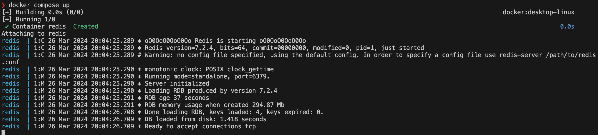
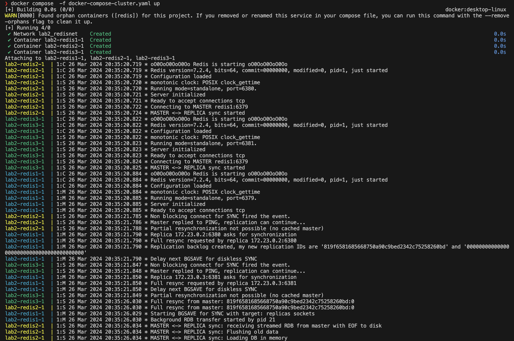

## Запуск через docker-compose

## Запуск redis

## Запуск redis cluster

## Сравнение времени выполнения операция

|       |   redis     | redis cluster  |   |   |
|---    |-------------|----------------|---|---|
|set    |   756 ms    |  728 ms        |   |   |
|get    |   152 ms    |  178 ms        |   |   |
|hset   |   2.5 s     |  2.17 s        |   |   |
|hgetall|   6.78 s    |  2.19 s        |   |   |
|zadd   |   4.13 s    |  3.41 s        |   |   |
|zrange |   1.98 s    |  1.13 s        |   |   |
|lpush  |   2min 39s  |  3min 26s      |   |   |
|lrange |   1.7 s     |  990 ms        |   |   |

## Для большинства операций время на запись увеличилось, на чтение ускорилось