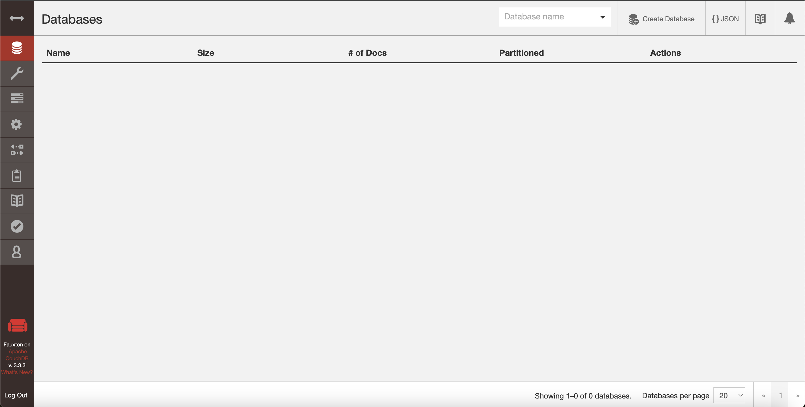
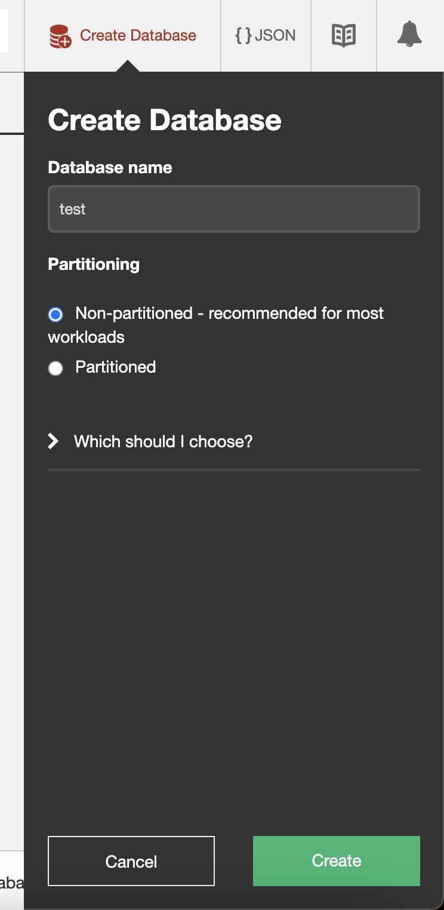
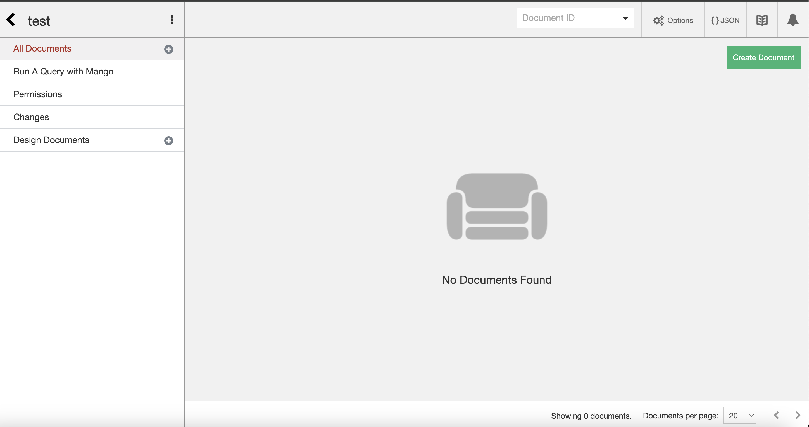
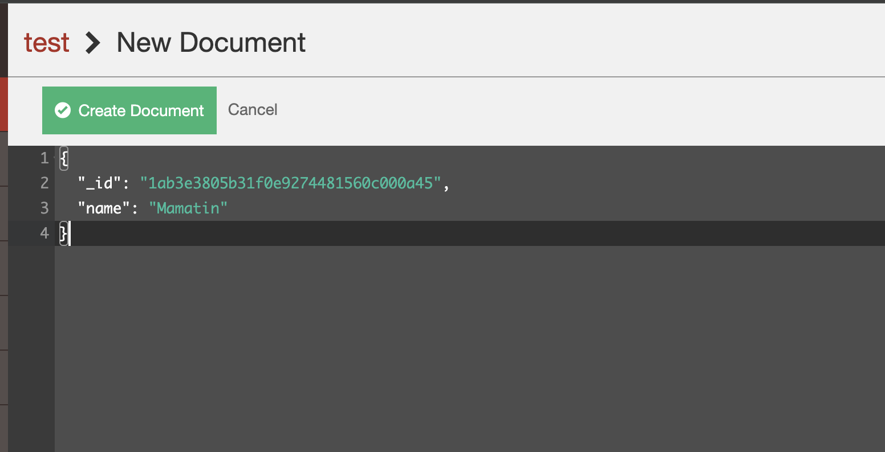
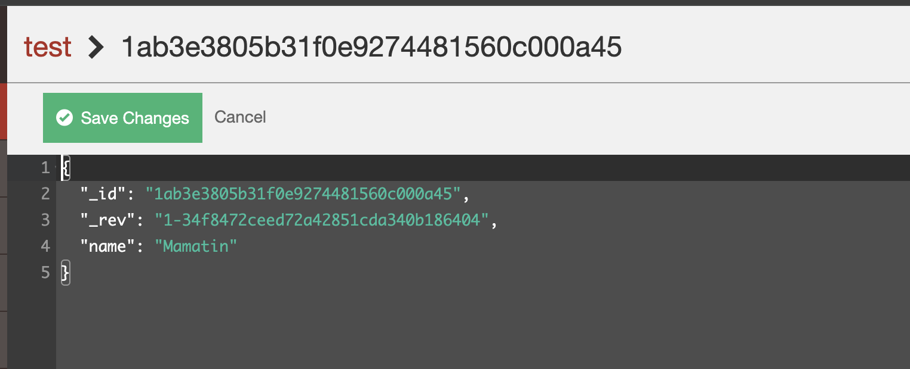
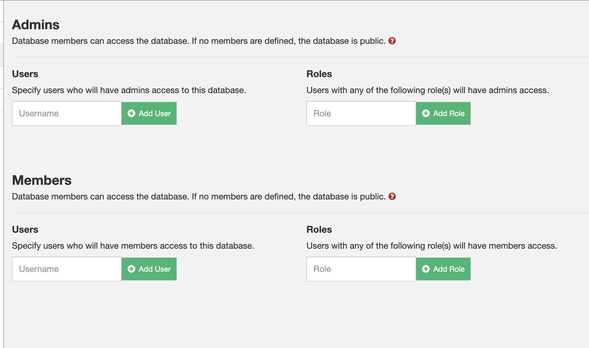
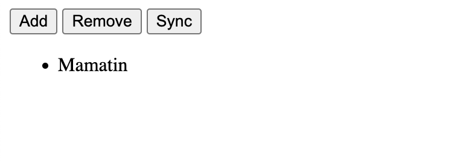

## Установка 

Скачал и установил отсюда: https://neighbourhood.ie/download-apache-couchdb-mac/

## Запустил

## Создание БД

## Созданная БД

## Создание документа

## Созданный документ

## Удаление пользователя для авторизации

## Вызов sync и отображение после отключения сервера БД

## saved.html - файл с сохраненной фамилией
