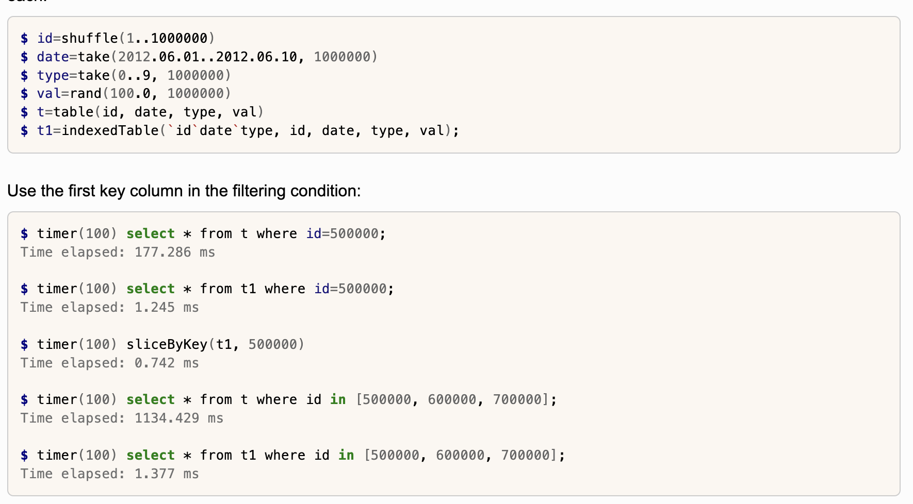
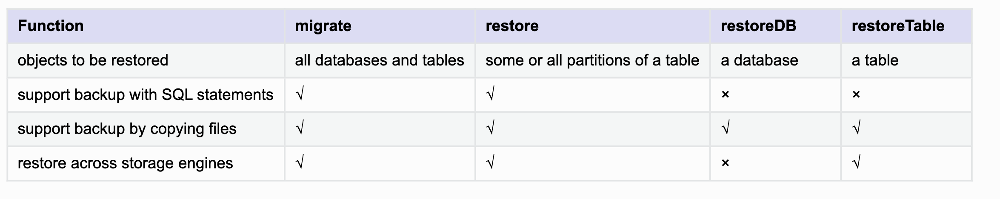
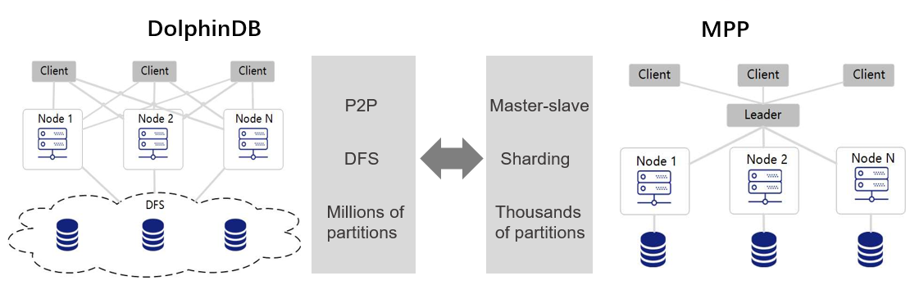
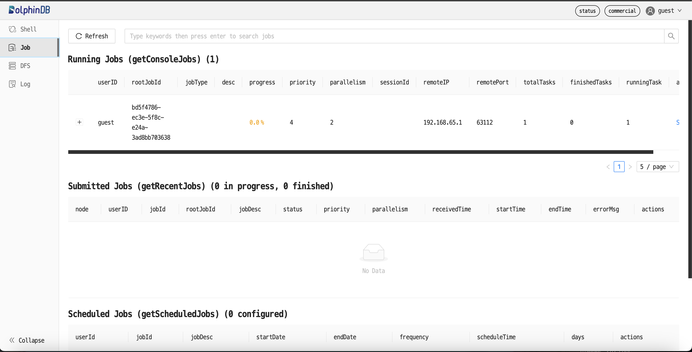
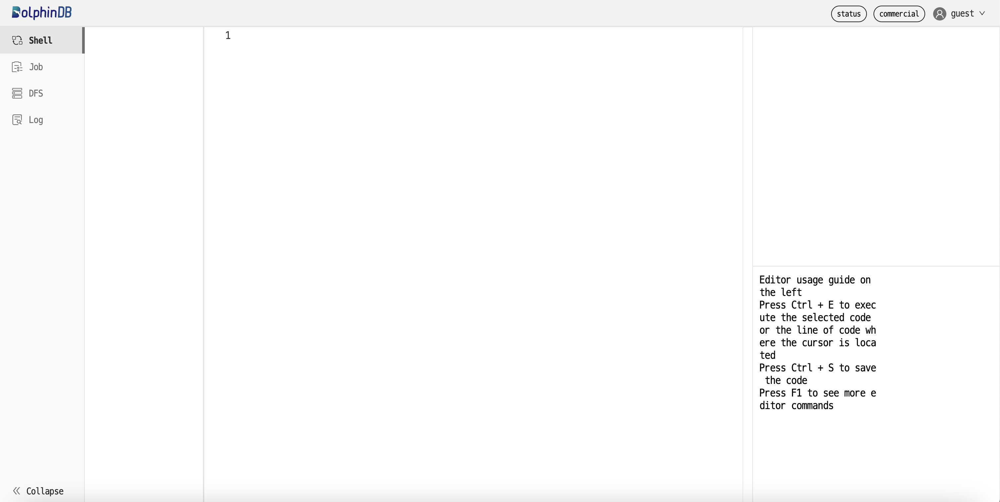
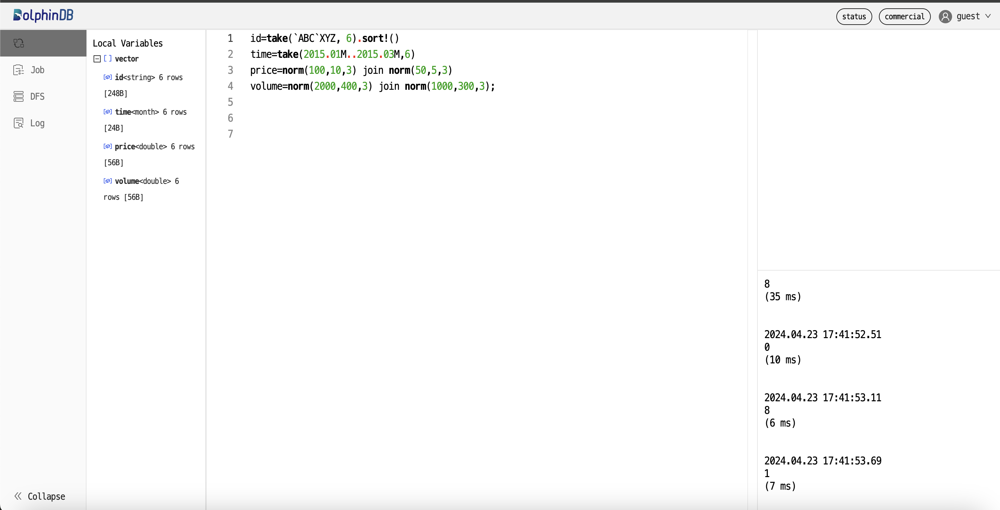
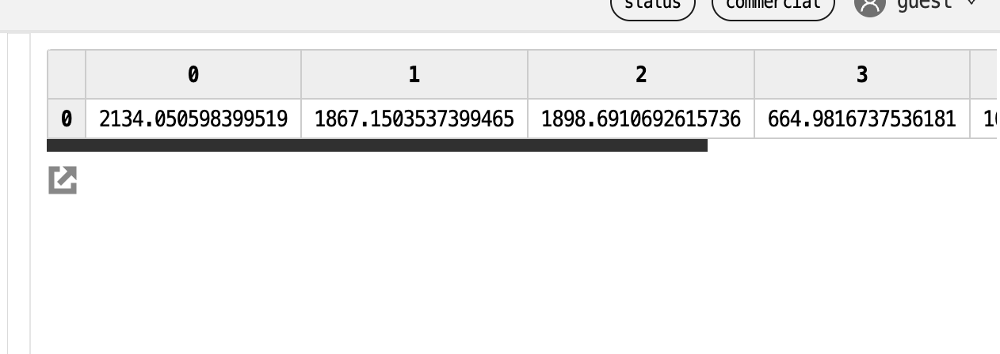
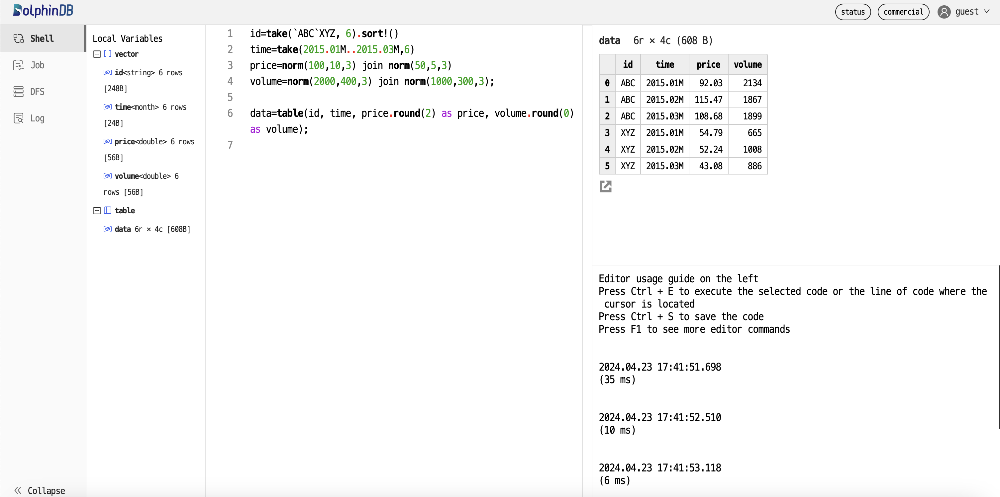
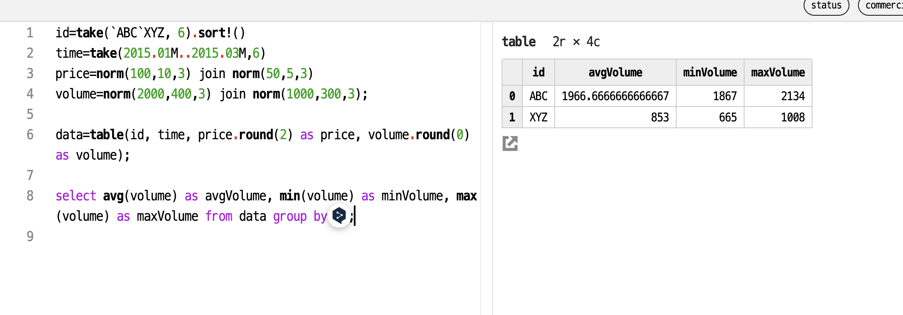
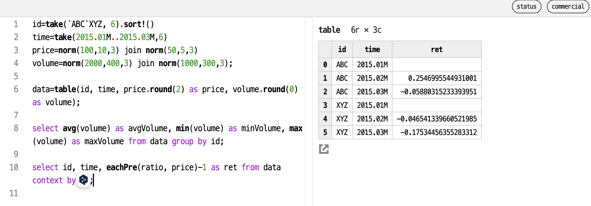

#  DolphinDB  Time Series


# История развития СУБД
Компания DolphinDB, Inc. была основана в 2016 году, и ее флагманский продукт DolphinDB - это платформа для аналитики и потоковой обработки данных в режиме реального времени, основанная на высокопроизводительной базе данных временных рядов. Обладая полнофункциональным языком программирования, более чем 1500 встроенными функциями и набором движков потоковых вычислений, DolphinDB предоставляет решения для хранения, запроса, аналитики и расчета массивных структурированных данных в режиме реального времени, что значительно повышает эффективность в различных аспектах количественных инвестиционных исследований, включая хранение данных и запросы, расчет коэффициентов, тестирование стратегий на практике и торговля в режиме реального времени.

Клиентская база DolphinDB охватывает всю Европу, Соединенные Штаты, Австралию и Китай. DolphinDB широко используется в различных секторах бизнеса, включая финансы, энергетику, интеллектуальное производство, телекоммуникации, химическую инженерию, управление водными ресурсами, маркетинговую аналитику и "умные города". С помощью DolphinDB предприятия могут эффективно извлекать выгоду из обширных наборов данных, особенно данных в режиме реального времени, расширяя возможности управления бизнес-системами в режиме реального времени и способствуя своевременному принятию бизнес-решений. По состоянию на октябрь 2023 года, в рейтинге всемирно известного веб-сайта по составлению рейтинга баз данных DB-Engines, DolphinDB занимает шестое место в категории глобальных баз данных временных рядов.

Источники:
https://dolphindb.com/news/detail/216
https://www.prnewswire.com/news-releases/dolphindb-to-offer-access-to-ice-consolidated-feed-and-historical-tick-data-301804997.html

# Инструменты для взаимодействия с СУБД
Клиенты с графическим интерфейсом
Dolphin DB предоставляет расширение VS Code (рекомендуется), поддерживающее язык программирования Dolphin DB, позволяющее пользователям управлять скриптами DolphinDB в VS Code и отправлять их на сервер DolphinDB для выполнения.

Python/Java/C#/C++ API


Источники: https://docs.dolphindb.com/en/Tutorials/dolphindb_user_guide.html


# Какой database engine используется в вашей СУБД?
TSDB storage engine that was released in DolphinDB 2.0.

До версии 2.0 DolphinDB единственным средством хранения данных был OLAP-движок. Каждый столбец в разделе таблицы сохраняется в виде файла. Данные хранятся в том порядке, в котором они записываются, что делает запись очень эффективной.

OLAP-движок имеет следующие основные ограничения:

(1) В разделе нет индекса, что означает, что (выбранные столбцы) всего раздела должны быть загружены даже для запросов, содержащих только 1 запись;

(2) Дедупликация не может быть выполнена во время записи;

(3) Он не подходит для таблиц, содержащих более нескольких сотен столбцов.

(4) Чтобы изменить одну запись, необходимо переписать весь раздел.

Механизм хранения данных TSDB может преодолеть вышеупомянутые ограничения механизма OLAP. Он разработан на основе дерева слияния с логической структурой (LSM Tree). Данные в каждом разделе хранятся в файлах уровней. Данные в каждом файле уровней отсортированы и имеют блочную индексацию.

Механизм TSDB имеет следующие преимущества перед механизмом OLAP:

(1) Запросы со столбцами секционирования и столбцами сортировки внутри раздела в условиях фильтрации имеют чрезвычайно высокую производительность;

(2) Данные могут быть отсортированы, а дублирующиеся данные могут быть удалены по мере записи в базу данных.

(3) Подходит для хранения таблиц с сотнями или тысячами столбцов (до 32 767 столбцов). Также поддерживает такие типы данных, как массив-вектор или большой двоичный объект.;

(4) Если для повторяющихся записей сохраняется только последняя запись (установите значение keepDuplicates = LAST для функции createPartitionedTable), то для обновления записи необходимо переписать только файл уровня, к которому относится эта запись, а не весь раздел.

Движок TSDB имеет следующие недостатки по сравнению с движком OLAP:

(1) Более низкая пропускная способность при записи, поскольку данные необходимо сортировать в механизме кэширования, а файлы уровней могут быть объединены и уплотнены;

(2) Более низкая производительность при чтении данных из всего раздела или столбцов во всем разделе.


Источник: https://docs.dolphindb.com/en/Tutorials/tsdb_engine.html


# Как устроен язык запросов в вашей СУБД? Разверните БД с данными и выполните ряд запросов. 

Используется ANSI SQL


Пример использования будет в конце


# Распределение файлов БД по разным носителям?
Кластеры DolphinDB работают в двух режимах: автономном режиме и режиме DFS. В автономном режиме система напрямую использует файловую систему операционной системы для хранения данных и использует статическую маршрутизацию для определения местоположения разделов. В режиме DolphinDB создает распределенные базы данных и выполняет распределенные вычисления поверх распределенной файловой системы. По сравнению с файловой системой в автономном режиме, DFS обеспечивает поддержку транзакций, отказоустойчивость и балансировку нагрузки.

Dolphin DB предоставляет различные схемы партиционирования, включая последовательности, значения, диапазоны и списки.

Источник: https://docs.dolphindb.cn/en/help200/DatabaseandDistributedComputing/index.html

# На каком языке/ах программирования написана СУБД?

С++

Источник: https://docs.dolphindb.cn/en/help200/Introduction/index.html#:~:text=DolphinDB%20is%20written%20in%20C,for%20integration%20with%20existing%20applications.


# Какие типы индексов поддерживаются в БД? Приведите пример создания индексов.

Существует отдельный тип таблицы - indexedTable. 
Он представляет собой особый тип таблицы in-memory с первичным ключом. Первичным ключом может быть один столбец или несколько столбцов.

Пример:


Источник: https://docs.dolphindb.cn/en/help200/FunctionsandCommands/FunctionReferences/i/indexedTable.html

# Как строится процесс выполнения запросов в вашей СУБД?

Синтаксис распределенных SQL-запросов в Dolphin DB такой же, как и синтаксис обычных SQL-запросов. Когда SQL-запрос выполняется в распределенной среде, система на лету определяет, нужно ли ей искать данные на удаленных узлах.

Распределенный запрос - это SQL-запрос к таблице, разделенной на разделы. Распределенный запрос выглядит так же, как и обычный запрос. Сначала система определяет все релевантные разделы на основе условия where; затем переписывает запрос и отправляет новый запрос на узлы нод, где находятся релевантные разделы; наконец, объединяет результаты из всех релевантных партиций.

Источник: https://docs.dolphindb.cn/en/help200/DatabaseandDistributedComputing/DatabaseOperations/Queries.html

# Есть ли для вашей СУБД понятие «план запросов»? Если да, объясните, как работает данный этап.

Чтобы отслеживать производительность SQL-запроса в режиме реального времени и порядок его выполнения, можно распечатать план выполнения запроса, добавив “[HINT_EXPLAIN]” после ключевых слов SQL “select” или “exec”. Например:

```sql
select [HINT_EXPLAIN] * from tb where id > 20
```

SQL-запрос с “[HINT_EXPLAIN]” возвращает строку JSON, указывающую план выполнения, а не фактический результат запроса.

В настоящее время “[HINT_EXPLAIN]” не работает с инструкциями “update” и “delete”.

“[HINT_EXPLAIN]” может использоваться в запросах как к партиоцированным, так и к таблицам без партиционирования. Для запроса к секционированной таблице план выполнения содержит дополнительную информацию об операции mapreduce.


https://docs.dolphindb.cn/en/help/SQLStatements/hint_explain.html


# Поддерживаются ли транзакции в вашей СУБД? Если да, то расскажите о нем. Если нет, то существует ли альтернатива?

Оператор transaction инкапсулирует несколько SQL-инструкций из таблицы в памяти или общей таблицы в одну транзакцию, чтобы гарантировать атомарность, согласованность и изоляцию этих SQL-инструкций как группы. Если во время выполнения любой из этих SQL-инструкций возникает ошибка, все инструкции будут откатаны вместе.

Примечание: В настоящее время transaction поддерживает только инструкции SQL, за исключением create, alter, insert into.

Пример 
```bash
sym = `C`MS`MS`MS`IBM`IBM`C`C`C$SYMBOL
price= 49.6 29.46 29.52 30.02 174.97 175.23 50.76 50.32 51.29
qty = 2200 1900 2100 3200 6800 5400 1300 2500 8800
timestamp = [09:34:07,09:36:42,09:36:51,09:36:59,09:32:47,09:35:26,09:34:16,09:34:26,09:38:12]
t = table(timestamp, sym, qty, price);

share t as pub

def update_date(){
    update pub set qty=qty-50 where sym=`C
    update pub set price=price-0.5 where sym=`MS
    select ts from pub // column `ts does not exist
}
transaction {
    update_date()
}

eqObj(pub[`qty], qty)
true

eqObj(pub[`price], price)
true
```

# Какие методы восстановления поддерживаются в вашей СУБД. Расскажите о них.

Резервная копия

В DolphinDB резервное копирование данных выполняется по партициям. Можно использовать функцию резервного копирования для резервного копирования партиций, таблиц или базы данных.

Dolphins предлагает 2 типа резервного копирования:

(1) Резервное копирование путем копирования файлов

(2) Резервное копирование с помощью инструкций SQL

Для восстановления есть 4 функции: 



Источник: https://docs.dolphindb.cn/en/help200/DatabaseandDistributedComputing/DatabaseOperations/BackupandRestore.html

Пример
```bash
backup("/home/DolphinDB/backup",<select * from loadTable("dfs://compoDB","pt")>,true);

backup("/home/DolphinDB/backup",<select * from loadTable("dfs://compoDB","pt") where date>2017.08.10>,true);

restore("/home/DolphinDB/backup","dfs://compoDB","pt","%20170810%",true,temp);

```


# Расскажите про шардинг в вашей конкретной СУБД. Какие типы используются? Принцип работы.
Базы данных MPP (Massive Parallel Processing) обычно сначала разделяют данные по узлам с помощью hash sharding (горизонтальное), а затем внутри каждого узла выполняют дальнейшее разделение (вертикальное). В Dolphin DB логика шардирования и хранение данных в разделах независимы друг от друга. Распределенная файловая система (DFS) определяет места хранения разделов. Оптимизировано разделение хранилища по всему кластеру. По сравнению с базами данных MPP, Dolphin DB предоставляет более детализированные разделы. Данные более равномерно распределены по разделам, что позволяет лучше использовать ресурсы кластера.



DolphinDB поддерживает range, hash, value, list and composite.

- Range используют диапазоны для формирования разделов. Каждый диапазон определяется двумя соседними элементами вектора схемы раздела. Это наиболее часто используемый тип разделов.

- Hash используют хеш-функцию на столбце раздела.

- value -  каждый элемент вектора схемы разбиения соответствует разделу.

- list разбивает данные в соответствии со списком. Он более гибкий, чем диапазонный домен.

- composite подходит для ситуаций, когда несколько столбцов часто используются в SQL where или group by в больших таблицах. Составной домен может иметь 2 или 3 столбца разметки. Каждый столбец может быть диапазоном, хэшем, значением или списком. 

Источник: https://github.com/dolphindb/Tutorials_EN/blob/master/database.md#52-transactions

# Возможно ли применить термины Data Mining, Data Warehousing и OLAP в вашей СУБД?

Data Mining

DolphinDB предоставляет средства для обнаружения скрытых шаблонов, трендов, аномалий и взаимосвязей в данных, позволяя проводить различные анализы данных для выявления ценной информации.

Data Warehousing

DolphinDB позволяет хранить данные из различных источников в оптимизированной структуре для последующего анализа.

OLAP

Один из поисковых движков OLAP  


# Какие методы защиты поддерживаются вашей СУБД? Шифрование трафика, модели авторизации и т.п.

Основные возможности системы контроля доступа:

- Позволяет удобно предоставлять /запрещать права доступа группам пользователей
- 9 типов прав доступа для различных сценариев
- Различные функции / команды контроля доступа
- Функциональные представления позволяют получать результаты анализа без ущерба для конфиденциальности данных
- Контроль доступа для запланированных заданий и потоковых задач
- Шифрование RSA для ключевой информации
- Поддерживает SSO для упрощения междоменного доступа

DolphinDB поддерживает HTTPS для безопасной связи через Интернет.


Источники:
https://github.com/dolphindb/Tutorials_EN/blob/master/ACL_and_Security.md

https://docs.dolphindb.cn/en/help/SystemManagement/SecureCommunication.html

# Какие сообщества развивают данную СУБД? Кто в проекте имеет права на коммит и создание дистрибутива версий? Расскажите об этих людей и/или компаниях.

github: https://github.com/dolphindb

В репозитории плагины и разные инструменты по работе с СУБД, репозитории под Apache-2.0 license. 
Cама СУБД закрытая.

Права на коммит и создание дистрибутива версий DolphinDB принадлежат компании DolphinDB Technology Co., Ltd., которая является разработчиком и основным участником проекта DolphinDB.


# Создайте свои собственные данные для демонстрации работы СУБД. 

Пример использования будет в конце


# Как продолжить самостоятельное изучение языка запросов с помощью демобазы. Если демобазы нет, то создайте ее.

Пример создания базы в примере ниже. Для изучения можно воспользоваться интернетом, там множество материалов по изучению ANSI SQL  


# Где найти документацию и пройти обучение
https://github.com/dolphindb/Tutorials_EN
https://docs.dolphindb.cn/en/help200/index.html
https://docs.dolphindb.com/en/index.html


# Как быть в курсе происходящего

Следить за источниками и соц сетями

https://dolphindb.com/news

https://github.com/dolphindb

https://twitter.com/DolphinDB_Inc

https://stackoverflow.com/questions/tagged/dolphindb

https://dolphindb.slack.com/unsupported-geo

https://www.youtube.com/@dolphindb8736


# Пример использования

Для запуска 

```bash
docker run -itd --name dolphindb \
  --hostname cnserver10 \
  -p 8848:8848 \
  -v /etc:/dolphindb/etc \
  dolphindb/dolphindb-arm64:v2.00.7 \
  sh
```

Далее перейти по localhost:8848

Будет такое окно



Для работы с бд надо перейти в shell

Вот так он выглядит



Сгенерирует данные для задачи: рассчитать сводную статистику и месячную доходность для каждой акции

Создание данных



Слева можно выбрать вектор и отобразить его



Создадим таблицу и отобразим ее




Можем рассчитать средний, минимальный и максимальный объем для каждой акции. Синтаксис здесь такой же, как и в ANSI SQL.




Рассчитаем месячную доходность


